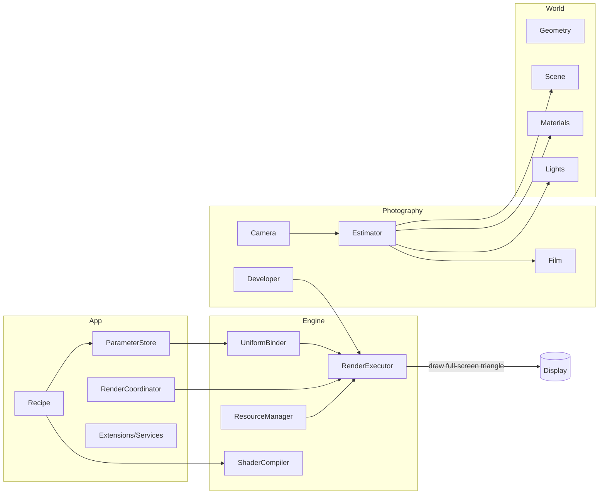

# Tiny Architecture Diagram

A compact view of how **App**, **Engine**, **Photography**, and **World** connect.

---

## ASCII (one screen)

```
        ┌────────────┐             ┌──────────────┐
        │    App     │             │    Engine    │
        │────────────│             │──────────────│
        │ Recipe     │             │ ShaderCompiler
        │ Parameter  │◄────────────┤ UniformBinder
        │ Coordinator│──────────┐  │ ResourceMgr
        │ Extensions │          │  │ RenderExec
        └─────┬──────┘          │  └───────┬──────┘
              │                 │          │
              │ parameters      │ uniforms │ FBOs/targets
              ▼                 │          ▼
        ┌────────────┐          │    ┌──────────────┐
        │ Photography│  GLSL    │    │    Film      │
        │ (Camera,   │◄─────────┼────┤ attachments  │
        │ Estimator, │   link   │    │ (GPU)        │
        │ Film, Dev) │──────────┼──► │ tonemap_out  │
        └─────┬──────┘          │    └──────────────┘
              │                 │
              │ calls           │ draw FS triangle
              ▼                 │
        ┌────────────┐          │
        │   World    │          │
        │ (Geom,     │          │
        │  Scene,    │          │
        │  Material, │          │
        │  Lights)   │          │
        └────────────┘          │
                                ▼
                         ┌──────────────┐
                         │    Display   │
                         └──────────────┘
```

---

## Mermaid (optional)

