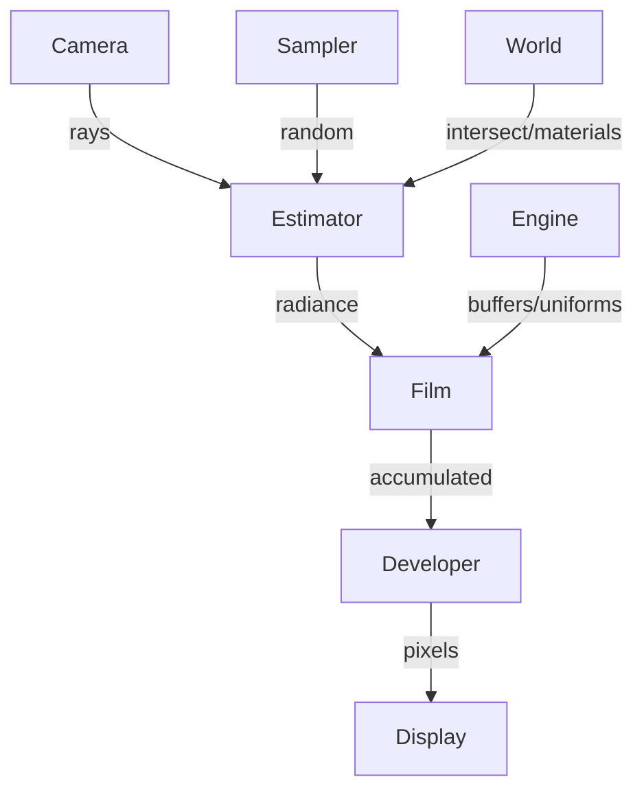

# Photography Pillar: Complete Overview

## Core Purpose

Photography defines **how we observe and measure light** in the rendered world. It's the algorithmic layer that transforms mathematical scene descriptions into images. While the World pillar defines *what exists*, Photography defines *how we see it*.

## System-Level Responsibilities

### What Photography Provides to the System

1. **Ray Generation Strategy** - How rays originate from the viewer
2. **Integration Algorithm** - How radiance is computed along paths
3. **Sampling Strategy** - How random decisions are made deterministically
4. **Accumulation Logic** - How samples combine over time
5. **Output Transformation** - How HDR radiance becomes displayable pixels

### What Photography Needs from Other Pillars

**From World:**
- `g_geodesic(origin, direction, t)` - Ray marching in the geometry
- `s_intersect(ray, hit)` - Scene intersection queries
- `m_eval(wi, wo, hit)` - Material evaluation
- `m_sample(wi, hit, rand)` - Material sampling
- `l_sample_light()` - Light sampling (if using NEE)

**From Engine:**
- Frame counting (`u_frame_index`, `u_sample_count`)
- Resolution (`u_resolution`)
- Film buffers (radiance, variance, auxiliary)
- Random seed management
- Parameter binding

**From App:**
- Module selection and composition
- Parameter updates from UI/controls
- Render mode (realtime vs convergent)
- Stop/start/reset commands

## Module Division Philosophy

The division into Camera, Sampler, Estimator, Film, and Developer follows the **physical metaphor of photography** while maintaining **mathematical independence**:

```
Light → [Camera Lens] → [Sensor/Film] → [Development] → Image
Maps to:
Radiance → [Ray Generation] → [Integration] → [Accumulation] → [Tone Mapping] → Pixels
```

### Why This Division?

1. **Swappability**: Change camera without changing integrator
2. **Testability**: Test each component independently
3. **Mathematical Clarity**: Each module maps to a specific equation/algorithm
4. **Research Flexibility**: Compare different sampling strategies with same integrator

## Module Types in Detail

### Camera Module - "The Observer"

**Mathematical Role**: Defines the measurement operator mapping image coordinates to rays.

**Variations to Implement:**

**Basic:**
- **Pinhole**: Simple perspective projection
  ```glsl
  // No depth of field, everything in focus
  Ray ray = Ray(camera_pos, normalize(world_dir));
  ```

**Depth of Field:**
- **ThinLens**: Finite aperture camera
  ```glsl
  // Sample point on lens
  vec2 lens_point = aperture * sample_disk(rand);
  // Rays converge at focal distance
  ```

**Special Projections:**
- **Fisheye**: Wide-angle with distortion
- **Orthographic**: Parallel rays (architectural viz)
- **Spherical/Equirectangular**: 360° capture
- **Stereoscopic**: Dual cameras for VR

**Research:**
- **Light Field**: 4D ray space (u,v,s,t)
- **Coded Aperture**: Computational photography

**Implementation Guidance for LLMs:**
- Cameras should be stateless - same inputs always produce same ray
- Use `xi` parameter for antialiasing, not internal randomness
- Normalize ray directions before returning
- Consider aspect ratio in FOV calculations

### Sampler Module - "The Randomness"

**Mathematical Role**: Provides the random variates for Monte Carlo integration.

**Variations to Implement:**

**Basic:**
- **Uniform**: Standard pseudo-random
  ```glsl
  float rand = fract(sin(dot(seed, vec2(12.9898, 78.233))) * 43758.5453);
  ```

**Low-Discrepancy:**
- **Halton**: Base-2, base-3 sequences
  ```glsl
  float halton(int index, int base) {
    // Van der Corput sequence
  }
  ```
- **Sobol**: Bit manipulation for stratification
- **Hammersley**: 2D points on unit square

**Blue Noise:**
- **TextureBased**: Precomputed blue noise textures
  ```glsl
  vec2 noise = texture(blue_noise_tex, pixel_id % 128).xy;
  ```
- **Procedural**: On-the-fly blue noise generation

**Adaptive:**
- **Importance**: More samples in high-variance regions
- **Progressive**: Refining sample patterns

**Implementation Guidance for LLMs:**
- **Determinism is critical** - same (pixel, sample, dimension) must always return same value
- Dimension parameter prevents correlation between different random choices
- Consider providing specialized shapes (disk, sphere, hemisphere) as convenience
- Blue noise textures should tile seamlessly

### Estimator Module - "The Algorithm"

**Mathematical Role**: Implements the rendering equation solver.

**Variations to Implement:**

**Direct Only (Realtime):**
- **Lambert**: Diffuse direct lighting only
- **BlinnPhong**: Simple specular model
- **Ambient**: Constant ambient + direct

**Path Tracing Family:**
- **NaivePath**: Pure random walk
  ```glsl
  for(int bounce = 0; bounce < max_bounces; bounce++) {
    radiance *= brdf * cos_theta / pdf;
  }
  ```
- **NEE** (Next Event Estimation): Direct light sampling at each vertex
- **MIS** (Multiple Importance Sampling): Optimal combination of strategies
- **RussianRoulette**: Probabilistic termination

**Bidirectional (Future):**
- **BDPT**: Paths from eye and light
- **MLT**: Metropolis Light Transport
- **VCM**: Vertex Connection and Merging

**Debug Modes:**
- **Normals**: `return hit.n * 0.5 + 0.5`
- **Depth**: `return vec3(hit.t / max_depth)`
- **MaterialID**: `return color_from_id(hit.mat_id)`
- **UV**: `return vec3(hit.uv, 0)`
- **Wireframe**: Edge detection
- **AO**: Ambient occlusion

**Implementation Guidance for LLMs:**
- Track dimension counter to avoid correlation in random samples
- Handle edge cases: no intersection returns background/environment
- Consider numerical precision for many bounces
- Debug modes should bypass complex math for clear visualization
- Use `e_` prefix for all exported functions

### Film Module - "The Accumulator"

**Mathematical Role**: Implements the temporal integration of samples.

**Variations to Implement:**

**Basic:**
- **Passthrough**: No accumulation (realtime rendering)
  ```glsl
  return new_sample;
  ```
- **SimpleAverage**: Running mean
  ```glsl
  return mix(history, new_sample, 1.0 / (count + 1.0));
  ```

**Advanced:**
- **ExponentialMovingAverage**: Recent samples weighted more
- **VarianceTracking**: Welford's algorithm for online variance
  ```glsl
  float delta = new_sample - mean;
  mean += delta / count;
  M2 += delta * (new_sample - mean);
  variance = M2 / (count - 1);
  ```

**Adaptive:**
- **ConfidenceInterval**: Stop when variance below threshold
- **Outlier**: Reject fireflies
- **Temporal**: Motion vectors for temporal stability

**Research:**
- **ReSTIR**: Reservoir-based resampling
- **Gradient**: Track gradients for reconstruction

**Implementation Guidance for LLMs:**
- Films are stateless between pixels but stateful between frames
- Use engine-provided buffers (`u_film_radiance`, etc.)
- Consider numerical stability for thousands of samples
- Variance tracking needs careful incremental computation
- Some films may write to multiple buffers (color + variance)

### Developer Module - "The Processor"

**Mathematical Role**: Maps HDR radiance to displayable LDR values.

**Variations to Implement:**

**Tone Mapping:**
- **Reinhard**: Simple S-curve
  ```glsl
  color = color / (1.0 + color);
  ```
- **ACES**: Film industry standard
- **Filmic**: Hable's Uncharted 2 curve
- **AgX**: Blender's new default

**Color Grading:**
- **Exposure**: Multiply by 2^exposure
- **ContrastSaturationBrightness**: Standard adjustments
- **ColorBalance**: Shadows/midtones/highlights
- **LUT**: 3D lookup tables

**Effects:**
- **Bloom**: Glow for bright areas
- **Vignette**: Darken corners
- **ChromaticAberration**: Color fringing
- **FilmGrain**: Noise for film look

**Analysis:**
- **FalseColor**: Map values to heatmap
- **Histogram**: Visualization overlay
- **Zebra**: Overexposure warning
- **Waveform**: Video-style scopes

**Implementation Guidance for LLMs:**
- Developers should clamp output to [0,1] for display
- Apply gamma correction as final step
- Effects can be chained - each processes previous output
- Analysis modes may intentionally exceed [0,1] for visualization
- Consider performance - developers run every frame

## Implementation Patterns for LLMs

### Module Template
```typescript
export class YourModule implements ModuleDescriptor {
  id = { 
    kind: "ModuleType", 
    name: "YourName", 
    version: "1.0.0" 
  };
  
  parameters = [
    // Declare parameters without u_ prefix
    { name: "param", kind: "float", default: 1.0 }
  ];
  
  fragment = {
    // Uniforms will be auto-prefixed
    uniforms: `uniform float param;`,
    
    // Use contract-specified prefixes
    functions: `
      vec3 prefix_function() {
        // Implementation
      }
    `,
    
    provides: ["prefix_function"],
    requires: ["other_function"]  // If needed
  };
}
```

### Common Pitfalls to Avoid

1. **Don't use random() directly** - Always go through sampler
2. **Don't access globals** - Pass everything as parameters
3. **Don't assume resolution** - Use u_resolution
4. **Don't hardcode aspect ratio** - Calculate from resolution
5. **Don't forget normalization** - Ray directions, normals
6. **Don't accumulate in estimator** - That's the film's job

### Testing Guidance

Each module should be testable in isolation:

```typescript
// Test camera produces normalized rays
// Test sampler produces values in [0,1]
// Test estimator with mock world functions
// Test film accumulation convergence
// Test developer output range
```

### Performance Considerations

- **Cameras**: Computation happens per pixel - keep lightweight
- **Samplers**: Called many times per pixel - optimize thoroughly
- **Estimators**: The hot path - every operation counts
- **Films**: Runs per pixel per frame - avoid complex math
- **Developers**: Post-process entire image - consider cache locality

## Module Interactions



## Configuration Examples

### Realtime Explorer
```typescript
modules: [
  PinholeCamera,      // Fast
  UniformSampler,     // Simple
  DirectOnlyEstimator,// Single bounce
  PassthroughFilm,    // No accumulation
  ReinhardDeveloper   // Quick tonemap
]
```

### Production Renderer
```typescript
modules: [
  ThinLensCamera,     // DOF
  BlueNoiseSampler,   // Quality
  PathTracerMIS,      // Full GI
  VarianceFilm,       // Adaptive
  ACESDeveloper       // Film-standard
]
```

### Debug Visualizer
```typescript
modules: [
  PinholeCamera,
  UniformSampler,
  NormalEstimator,    // Debug mode
  PassthroughFilm,
  FalseColorDeveloper // Analysis
]
```

## File Tree

```
photography/
├── contracts/                 # Module interface specifications
│   ├── CAMERA_CONTRACT.md     # Ray generation requirements
│   ├── SAMPLER_CONTRACT.md    # Random number generation requirements  
│   ├── ESTIMATOR_CONTRACT.md  # Radiance calculation requirements
│   ├── FILM_CONTRACT.md       # Accumulation requirements
│   └── DEVELOPER_CONTRACT.md  # Output processing requirements
│
├── cameras/                   # Ray generation from image plane
│   ├── pinhole/              # Simple perspective projection
│   ├── thin-lens/            # Depth of field via aperture
│   ├── fisheye/              # Wide-angle distortion
│   ├── orthographic/         # Parallel rays (no perspective)
│   └── spherical/            # 360° environment capture
│
├── samplers/                  # Deterministic random numbers
│   ├── uniform/              # Basic pseudo-random
│   ├── halton/               # Low-discrepancy sequence
│   ├── sobol/                # Bit-based stratification
│   ├── blue-noise/           # Optimally distributed samples
│   └── stratified/           # Jittered grid sampling
│
├── estimators/                # Light transport algorithms
│   ├── direct/               # Single bounce illumination
│   ├── path/                 # Multiple bounce path tracing
│   │   ├── naive/           # Pure random walk
│   │   ├── nee/             # Next event estimation
│   │   └── mis/             # Multiple importance sampling
│   ├── ambient/              # Constant + direct light
│   └── debug/                # Visualization modes
│       ├── normals/         # Surface normal display
│       ├── depth/           # Distance visualization
│       ├── uv/              # Texture coordinate display
│       ├── material-id/     # Material identification
│       └── ao/              # Ambient occlusion
│
├── films/                     # Sample accumulation over time
│   ├── passthrough/          # No accumulation (realtime)
│   ├── simple-average/       # Running mean
│   ├── variance-tracking/    # Track convergence statistics
│   ├── exponential/          # Recent samples weighted more
│   └── adaptive/             # Variable samples per pixel
│
├── developers/                # HDR to display conversion
│   ├── tonemap/              # HDR to LDR mapping
│   │   ├── reinhard/        # S-curve compression
│   │   ├── aces/            # Film industry standard
│   │   ├── filmic/          # Game industry standard
│   │   └── agx/             # Modern Blender default
│   ├── grading/              # Color adjustments
│   │   ├── exposure/        # Brightness control
│   │   ├── contrast-saturation/  # Basic color controls
│   │   └── color-balance/   # Shadow/midtone/highlight
│   ├── effects/              # Visual enhancements
│   │   ├── bloom/           # Glow for bright areas
│   │   ├── vignette/        # Darken edges
│   │   └── grain/           # Film-like noise
│   └── analysis/             # Debug visualization
│       ├── false-color/     # Heatmap display
│       ├── histogram/       # Value distribution
│       └── zebra/           # Overexposure warning
│
├── configurations/            # Pre-built module combinations
│   ├── realtime.ts           # Fast preview (direct + passthrough)
│   ├── research.ts           # Reproducible testing setup
│   ├── production.ts         # High quality (MIS + variance)
│   └── debug.ts              # Visualization presets
│
├── templates/                 # Starter code for new modules
├── shared/                    # Common utilities (math, color, sampling)
├── tests/                     # Unit tests per module type
├── index.ts                   # Main module exports
└── README.md                  # Photography pillar overview
```

This overview provides the complete blueprint for implementing Photography. Each module type has clear responsibilities, expected variations, and implementation guidance that future LLMs can follow to build the system correctly.
